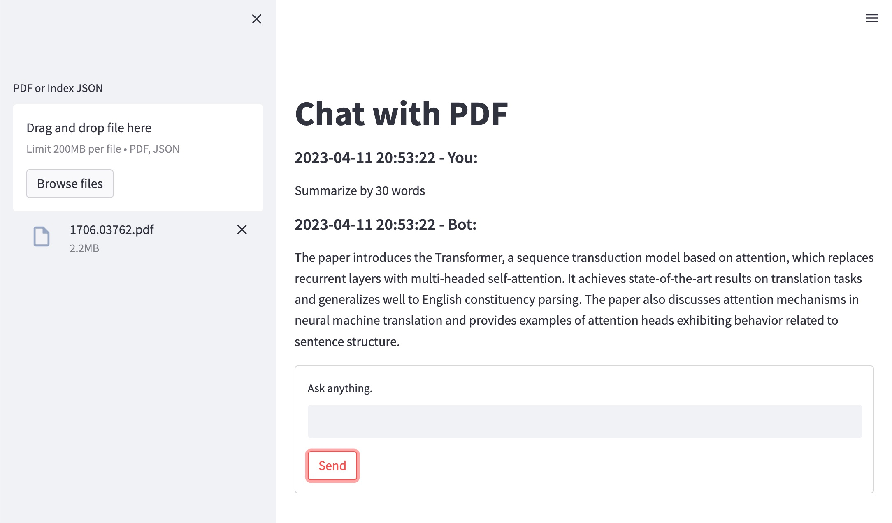

## Chat with PDF



## How to run
Install required libraries.
```
poetry install
```

Put OpenAI's API key in `.env` file. XXXXXXXXXXX is your API key.

```
echo OPENAI_API_KEY=XXXXXXXXXXX > .env
```

Run
```
poetry run streamlit run app.py
```
